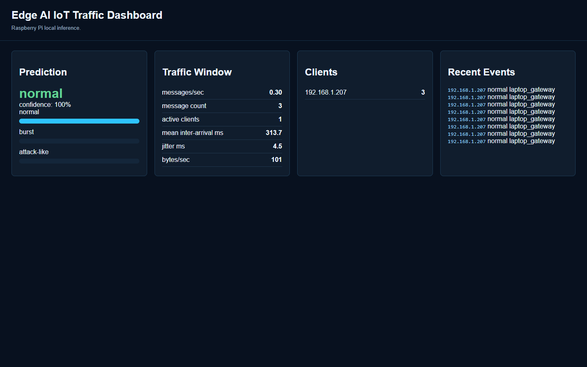
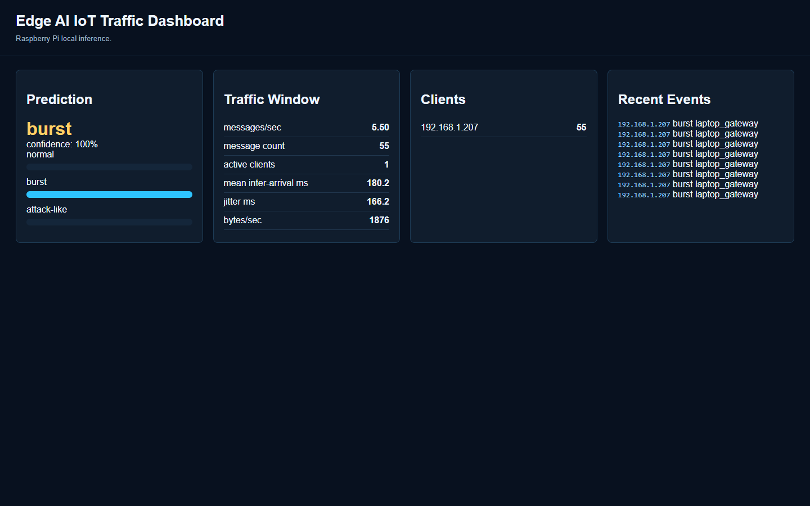
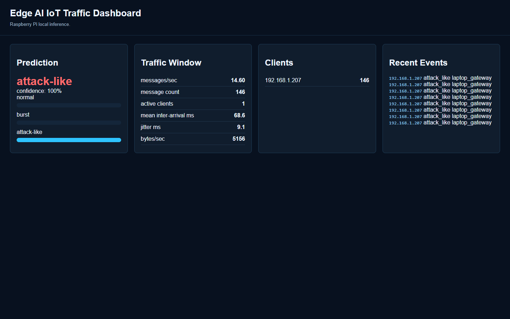

# Local Edge AI DoS-like Traffic Detection Package

This package contains the source code, trained models, evaluation results, figures and hardware evidence for:

**Local Edge AI detection of DoS-like / attack-like IoT traffic using an Arduino sensor node, Windows laptop gateway/client and Raspberry Pi 5 edge inference server.**

## Factual Topology

```text
Arduino Nano 33 BLE/Sense -> USB serial -> Windows laptop -> normal local Wi-Fi/router -> Raspberry Pi 5
```

- Arduino serial port: COM4 at 115200 baud.
- Arduino output: real IMU JSON readings.
- Laptop role: receives Arduino readings and generates controlled local HTTP request timing.
- Raspberry Pi role: receives requests, logs raw events, extracts traffic-window features, runs local ML inference and serves the dashboard.
- Tested Pi IP: 192.168.1.187.
- Laptop source IP in Pi logs: 192.168.1.207.
- Edge Impulse was not used; the deployed classifier is a custom Gaussian Naive Bayes model running locally on the Raspberry Pi.
- The normal local Wi-Fi/router provided the network path; the Pi was the edge inference server.
- The evaluated dataset uses one traffic client, so it is DoS-like / attack-like traffic detection rather than distributed DDoS.

## Final Dataset

- Raw request events: 7478.
- Recording runs: 30 total, with normal=8, burst=12 and attack_like=10.
- Window length: 10 seconds.
- ML windows: 90, with normal=24, burst=36 and attack_like=30.
- Split method: grouped by complete scenario_id; no run leaks across train/validation/test.
- Train/validation/test windows: 72 / 9 / 9.
- Excluded runs: 0.

## Key Results

- Final selected model: custom_gaussian_nb.
- Fixed grouped test accuracy: 0.889.
- Fixed grouped test macro-F1: 0.886.
- Fixed grouped test attack-like recall: 1.000.
- Fixed grouped test burst false alarm rate: 0.000.
- Fixed rule baseline test macro-F1: 0.222.
- Fixed rule baseline attack-like recall: 0.000.
- Tuned rate-only baseline test macro-F1: 0.750.
- Grouped 5-fold CV macro-F1: 0.952 +/- 0.026.
- Baseline grouped 5-fold CV macro-F1: 0.302 +/- 0.044.
- Model size: 2329 bytes.
- Pi classifier-only latency mean: 0.0158 ms over 3000 repetitions.
- Pi feature extraction plus classifier mean: 0.7085 ms.
- Expected dashboard-visible detection delay: about 10.7 seconds.
- Pi active collection CPU mean: 0.763% of one core.
- Pi active collection RSS mean: 27.71 MB.

## Dashboard Evidence

The dashboard below was served by the Raspberry Pi while the laptop generated each local traffic pattern.

| Normal | Burst | Attack-like |
|---|---|---|
|  |  |  |

## Contents

- `arduino/` - Arduino Nano 33 BLE/Sense IMU sketches.
- `laptop_gateway/` - laptop traffic gateway and real experiment runner.
- `pi_edge_ai/` - feature extraction, model, Pi server, evaluation and resource scripts.
- The dataset is kept separately from this code repository and contains raw events, windowed features and grouped train/validation/test splits.
- `models/` - trained Gaussian NB JSON plus comparison model artifacts.
- `evaluation/` - metrics, error analysis, resource usage and latency.
- `figures/` - evaluation plots and visual summaries.
- `evidence/` - real dashboard screenshots, terminal logs and system/serial evidence.
- `docs/` - method notes, hardware notes, benchmark mapping and limitations.

## Reproduce The Pi Server

On the Raspberry Pi:

```bash
cd ~/edge_ai_dos_testbed
python3 pi_edge_ai/pi_server.py --host 0.0.0.0 --port 8000 --model pi_edge_ai/models/traffic_classifier_10s_real.json --window-seconds 10
```

On the laptop, open:

```text
http://192.168.1.187:8000
```

## Original Collection Configuration

The separate dataset ZIP contains the collected data used for evaluation. The collection plan allowed up to 30 runs per class, but the final analysed dataset contains the first 30 completed hardware runs. The command shape was:

```bash
python laptop_gateway/experiment_runner.py --pi http://192.168.1.187:8000 --serial COM4 --baud 115200 --runs-per-class 30 --duration 30 --pause-between 2.5 --prompt-hold 15 --experiment-id cw2_real_20260818 --out-dir run_metadata
```

## Reproduce Evaluation

Extract the dataset folder beside this code folder, then run:

```bash
python pi_edge_ai/advanced_evaluation.py --raw-log ../dataset/raw/full_raw_events_20260818.csv --out-dir reproduced_evaluation_10s --window-seconds 10 --latency-repeats 2000
```

Pi-side latency was measured with:

```bash
python3 pi_edge_ai/pi_latency_benchmark.py --raw-log logs/events_20260818_111841.csv --model models/traffic_classifier_10s_real.json --window-seconds 10 --repeats 3000 --out reports/pi_latency_10s_20260818.json
```

The tuned rate-only baseline can be reproduced with:

```bash
python pi_edge_ai/tuned_rate_baseline.py --splits-dir ../dataset/splits --out evaluation/metrics/tuned_rate_baseline.json
```

## Safety And Limitations

All traffic stayed inside a local test network and targeted only the Raspberry Pi. The experiment does not claim distributed DDoS behaviour, internet-scale performance, production security performance, measured wall-power consumption, or external benchmark validation.
